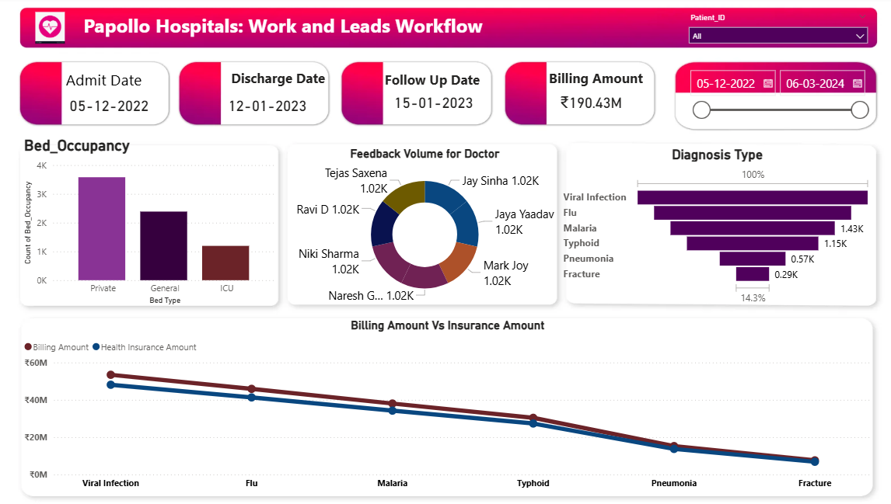

## Healthcare_Dashboard_Project
This project presents a healthcare analysis dashboard created in **Power BI** using a simulated dataset from Papollo Hospitals. The dashboard provides critical insights into hospital operations, billing workflows, and patient diagnoses.

## Dashboard

## Dashboard Overview
- Admit / Discharge / Follow-Up Dates
- Billing and Insurance Amount Analysis
- Bed Occupancy by Type
- Feedback Volume for Doctors
- Diagnosis Type Frequency
- Billing Amount Vs Insurance amount

## Business Questions
 1.Which type of beds (Private, General, ICU) have the highest occupancy?
2. What is the trend between the billing amount and the insurance amount across different diagnosis types?
3. Which diseases are most commonly diagnosed in the hospital?
4. Which doctors are receiving the most feedback from patients?
5. How does hospital revenue vary over time and by diagnosis?
6. Are there time periods where patient admission or discharge volume peaks?
7. How much is the average billing amount per patient, and how much of it is covered by insurance?

## Key Insights
  # 1.High Preference for Private Beds

    - Private beds are the most utilized, accounting for over 4,000 occupancies, nearly double that of general and ICU beds.

    - This indicates a higher preference or demand for private care, possibly reflecting patient income levels or insurance coverage patterns.

  # 2.Top Diagnosed Conditions
    - Viral Infection and Flu are the most common diagnoses, indicating seasonal or contagious disease trends.

    -Less frequent diagnoses like Fracture and Pneumonia may require specialized treatment but occur less often.

 # 3.Doctor Feedback Volume is Uniform
   -All listed doctors received similar feedback volumes (~1.02K each), suggesting a standardized or evenly distributed patient feedback mechanism.
   
 # 4.Billing vs Health Insurance Amount
   -Across all diagnosis types, billing amounts consistently exceed health insurance payouts, revealing a potential gap in insurance coverage.
   -This insight can help the hospital negotiate better insurance policies or offer financial assistance programs.

 # 5.Billing Peaks for Viral & Flu Cases

   -Viral infections lead to the highest billing amounts, followed closely by Flu, highlighting where most hospital revenue originates.

   -These cases could also reflect longer stays or more frequent testing and treatment procedures.

 # 6.Low ICU Utilization
    -ICU bed usage is significantly lower, suggesting either fewer critical cases or efficient patient triaging and care.

 # 7.Effective Follow-Up Scheduling

    -The gap between discharge and follow-up (approx. 1 month) indicates a well-structured post-care program, promoting better patient recovery monitoring.
 # Consistent Use of Date Filters

   -The dashboard allows filtering based on patient ID and dates, enabling targeted analysis across admission timelines and trends.

This analysis provides actionable insights to enhance hospital resource allocation, improve patient care strategies, and support data-driven decision-making in healthcare operations.
